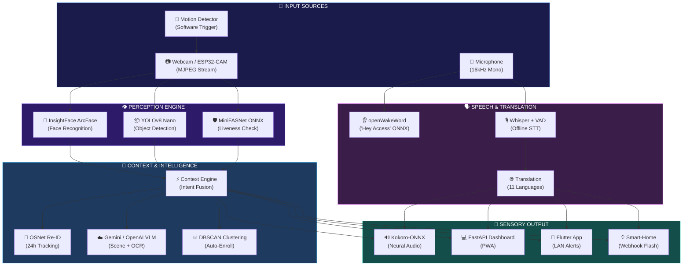

<div align="center">

<!-- ═══════════════════════════════════════════════════════════════════════ -->
<!-- ANIMATED HEADER BANNER                                                 -->
<!-- ═══════════════════════════════════════════════════════════════════════ -->


<!-- ═══════════════════════════════════════════════════════════════════════ -->
<!-- ANIMATED TYPING SVG                                                    -->
<!-- ═══════════════════════════════════════════════════════════════════════ -->

<br/>

<a href="https://git.io/typing-svg"></a>

<br/>

<!-- ═══════════════════════════════════════════════════════════════════════ -->
<!-- BADGES                                                                 -->
<!-- ═══════════════════════════════════════════════════════════════════════ -->

<!-- Row 1 — Core AI -->
<p>
&nbsp;
&nbsp;

</p>

<!-- Row 2 — AI + Voice -->
<p>
&nbsp;
&nbsp;

</p>

<!-- Row 3 — Status -->
<p>
&nbsp;
&nbsp;
&nbsp;

</p>

<br/>

<!-- ═══════════════════════════════════════════════════════════════════════ -->
<!-- HERO QUOTE                                                             -->
<!-- ═══════════════════════════════════════════════════════════════════════ -->

<table>
<tr>
<td>

> *"Rahul is at the front door. He is carrying a parcel. Likely a delivery.*
> *They said: 'Package for you.'"*
>
> — Spoken as **natural human voice** (Blind Mode) or shown as **large high-contrast text + visual pulse + quick-reply chat** (Deaf Mode), in **11 languages**, controllable completely **hands-free** via *"Hey Access"*.

</td>
</tr>
</table>

<br/>

<!-- NAV LINKS -->

[**⚡ Quick Start**](#-quick-start) &nbsp;•&nbsp;
[**🧠 Architecture**](#-system-architecture) &nbsp;•&nbsp;
[**🗺️ Phases**](#-development-phases-117) &nbsp;•&nbsp;
[**🎙️ Voice**](#-hands-free-voice-commands) &nbsp;•&nbsp;
[**🌐 API**](#-api-reference) &nbsp;•&nbsp;
[**🧪 Tests**](#-testing--verification)

</div>

<!-- ═══════════════════════════════════════════════════════════════════════ -->
<!-- WAVE DIVIDER                                                           -->
<!-- ═══════════════════════════════════════════════════════════════════════ -->


<br/>

## 🎯 The Problem We Solve

<div align="center">

```
╔══════════════════════════════════════════════════════════════════════════╗
║                                                                          ║
║   🔔  Standard Doorbell          →    "Someone is at the door."          ║
║                                                                          ║
║   🧠  AccessAI Doorbell          →    "Rahul is at the front door.       ║
║                                        He is carrying a parcel.          ║
║                                        Likely a delivery.                ║
║                                        They said: 'Package for you.'"   ║
║                                                                          ║
╚══════════════════════════════════════════════════════════════════════════╝
```

</div>

For **visually or hearing-impaired** individuals, a binary *ding-dong* creates anxiety, safety risks, and physical barriers. **AccessAI** transforms any camera stream into a full **multi-modal perception bridge** — processing face biometrics, object detection, anti-spoof liveness, scene understanding, speech recognition, translation, and neural text-to-speech — delivering personalized sensory output in **under 3 seconds**.

Built across **17 production-grade phases**, every capability below is wired into a single event pipeline, one dashboard, and one mobile client.

<br/>


<br/>

## 🔑 Dual Accessibility Modes

<div align="center">
<table>
<tr>
<td align="center" width="33%">

### 👁️ Blind Mode
100% **hands-free**. Listens for the custom wake phrase **"Hey Access"**, speaks detailed visitor announcements using human-like offline neural voice (**Kokoro-ONNX**), and accepts spoken natural language queries.

</td>
<td align="center" width="33%">

### 👂 Deaf Mode
Replaces audio with **high-contrast visual cards**, **flashing smart-home light webhooks**, auto-captions, and **instant quick-reply buttons** (e.g., *"Please leave the package at the door"*).

</td>
<td align="center" width="33%">

### 🌓 Both Mode
Full visual alerts **and** spoken neural audio **concurrently** — for users with partial impairment or multi-user households.

</td>
</tr>
</table>
</div>

<br/>


<br/>

## ⚡ Key Features

<div align="center">
<table>
<tr>
<td align="center" width="25%">
<br/>
<br/><br/>
<b>InsightFace ArcFace</b><br/>
Deep biometric identification with rolling vector DB for trusted vs. unknown classification
<br/><br/>
</td>
<td align="center" width="25%">
<br/>
<br/><br/>
<b>YOLOv8 Nano</b><br/>
Real-time object detection fused with intent algorithms for delivery & context awareness
<br/><br/>
</td>
<td align="center" width="25%">
<br/>
<br/><br/>
<b>MiniFASNet ONNX</b><br/>
Multi-spectral liveness analysis detecting photo/screen spoof attempts in real-time
<br/><br/>
</td>
<td align="center" width="25%">
<br/>
<br/><br/>
<b>Gemini / OpenAI VLM</b><br/>
Cloud vision for clothing, context & parcel OCR on unknown visitors
<br/><br/>
</td>
</tr>
<tr>
<td align="center" width="25%">
<br/>
<br/><br/>
<b>Kokoro-ONNX TTS</b><br/>
Human-quality offline neural synthesis with Edge-TTS & espeak fallback chain
<br/><br/>
</td>
<td align="center" width="25%">
<br/>
<br/><br/>
<b>Wake Word Engine</b><br/>
Custom "Hey Access" ONNX detector with offline Whisper STT & natural language commands
<br/><br/>
</td>
<td align="center" width="25%">
<br/>
<br/><br/>
<b>OSNet + DBSCAN</b><br/>
24-hour appearance tracking of repeat unknowns with auto-enrollment clustering
<br/><br/>
</td>
<td align="center" width="25%">
<br/>
<br/><br/>
<b>Flutter + Web PWA</b><br/>
Native cross-platform app & installable dashboard with LAN WebSocket alerts
<br/><br/>
</td>
</tr>
</table>
</div>

<br/>


<br/>

## 🛠️ Tech Stack

<div align="center">


<br/><br/>

| Layer | Technologies |
|:---:|:---|
| **🧠 AI / ML** | YOLOv8 · InsightFace ArcFace · MiniFASNet · OSNet · OpenAI Whisper · Silero VAD · openWakeWord · DBSCAN |
| **🗣️ Voice** | Kokoro-ONNX (offline neural) · Edge-TTS (online neural) · pyttsx3/espeak (fallback) |
| **🌐 Backend** | FastAPI · Uvicorn · SQLAlchemy · SQLite · Jinja2 · WebSockets |
| **📱 Frontend** | HTML5/CSS3/JS Dashboard · Progressive Web App · Flutter (Android/iOS) |
| **🔧 Inference** | ONNX Runtime · PyTorch 2.4.1 (CPU) · NumPy · OpenCV · Pillow |
| **🔒 Security** | Bearer Token Auth · IP Rate Limiting · HMAC-SHA256 Webhooks · CORS |

</div>

<br/>


<br/>

## 🧠 System Architecture

<div align="center">

AccessAI relies on a single immutable event entity — the **`VisitorEvent`** — which acts as the pipeline's backbone. Every module inspects, populates, or transforms fields on this event as it flows through perception, decision, translation, and notification stages.

</div>



<br/>


<br/>

## 🚀 Quick Start

```bash
# 1 ─ Clone
git clone https://github.com/access-ai-smart-doorbell/Access-AI.git
cd Access-AI

# 2 ─ Virtual environment (Python 3.12)
python3 -m venv .venv && source .venv/bin/activate

# 3 ─ System libraries (Linux)
sudo apt install -y espeak libportaudio2 ffmpeg build-essential python3-dev

# 4 ─ Install all dependencies (preserves strict torch 2.4.1 pin)
./scripts/install_deps.sh

# 5 ─ (Optional) Cloud vision keys for scene description + OCR
cp .env.example .env
#   OPENAI_API_KEY=your_key_here

# 6 ─ Launch 🚀
python3 run.py
```

<div align="center">

### 🌐 Open **`http://localhost:8000`** — your AccessAI dashboard is live!

<br/>

| Action | What Happens |
|:---|:---|
| 🔔 **Ring Doorbell** | Full perception pipeline: face → objects → anti-spoof → scene/OCR → speech → translation → re-ID → intent → announcement |
| 🎤 **Speak a Command** | Push-to-talk voice interaction via Whisper |
| 👂 **Always Listening** | Continuous wake-word detection ("Hey Access") |
| 📊 **System Health** | Live module status with colour-coded indicators |

</div>

> **No webcam?** The app still runs headlessly — triggers fall back to a blank frame so events, snapshots, and history keep working.

<br/>


<br/>

## 🗺️ Development Phases (1–17)

<div align="center">

Every phase is **100% implemented, tested, and functional** in this codebase.

</div>

| Phase | Capability | Key Modules | Status |
|:---:|:---|:---|:---:|
| **01** | 🏗️ Foundation — camera → `VisitorEvent` → snapshot → SQLite → dashboard | `pipeline` · `camera` · `database` · `server` | ✅ |
| **02** | 👤 Deep Face Recognition (InsightFace ArcFace) | `face_module` | ✅ |
| **03** | 📦 Object & Scene Detection (YOLOv8) + Intent Fusion | `vision_module` · `context_engine` | ✅ |
| **04** | ♿ Accessibility Output — TTS + Blind/Deaf/Both routing | `accessibility` · `tts_module` | ✅ |
| **05** | 🛡️ Anti-Spoofing & Liveness (MiniFASNet ONNX) | `antispoof_module` | ✅ |
| **06** | ☁️ Cloud VLM Scene Description + Parcel OCR | `vlm_module` | ✅ |
| **07** | 🎙️ Offline Speech Recognition (Whisper + Silero VAD) | `speech_module` | ✅ |
| **08** | 🌐 Multi-Language Translation (11 Languages) | `translate_module` | ✅ |
| **09** | 🔄 Visitor Re-ID + DBSCAN Auto-Enrollment | `reid_module` · `auto_enroll` | ✅ |
| **10** | 🎯 Hands-Free Voice Commands + Wake Word | `wakeword_module` · `voice_commands` | ✅ |
| **11** | 🗣️ Natural Offline Neural TTS (Kokoro-ONNX) | `tts_module` | ✅ |
| **12** | ⚡ Async Background VLM Enrichment (Speed-up) | `pipeline` · `vlm_module` | ✅ |
| **13** | 📸 Browser-Based Photo Enrollment | `server` · `face_module` | ✅ |
| **14** | 📱 Responsive PWA Dashboard | `web/` | ✅ |
| **15** | 👥 Multi-Person Group Scene Handling | `visitor_event` · `accessibility` | ✅ |
| **16** | 📲 Native Flutter Mobile App | `mobile/` | ✅ |
| **17** | 🔒 LAN Hardening — Auth, Rate Limits, HMAC, Motion | `server` · `motion_module` | ✅ |

<br/>


<br/>

## 🎙️ Hands-Free Voice Commands

<div align="center">

For blind users, AccessAI provides **complete voice-driven control** requiring zero physical interaction.

<br/>

<a href="https://git.io/typing-svg"></a>

</div>

<br/>

| 🗣️ Say This | ⚡ Intent | 📢 System Response |
|:---|:---:|:---|
| *"Who is at the door?"* | `who_is_there` | Captures frame → runs full pipeline → speaks announcement |
| *"Analyze the door"* / *"What do you see?"* | `analyze_now` | Re-evaluates visual scene with detailed description |
| *"Recent visitors"* / *"Who came earlier?"* | `recent` | Queries database → speaks latest visitor summary |
| *"How many visitors today?"* | `count_today` | Counts today's events → announces total |
| *"Open the camera"* | `open_camera` | Confirms & focuses live stream on dashboard |
| *"Set blind / deaf mode"* | `set_mode` | Dynamically toggles accessibility output mode |
| *(Any unknown phrase)* | `unknown` | Friendly spoken help listing available commands |

> **Design:** `parse_command()` is a pure, unit-tested function (no I/O). `handle_command()` is the only place that touches the world. Voice **reuses** Phase-7 Whisper and Phase-4/11 TTS — it never duplicates capture or announcement logic.

<br/>


<br/>

## 🌐 API Reference

<div align="center">

AccessAI exposes a full **RESTful + WebSocket** API via **FastAPI**:

</div>

| Method | Endpoint | Description |
|:---:|:---|:---|
| `GET` | `/` | 💻 Responsive web dashboard & PWA |
| `GET` | `/video` | 📷 Live MJPEG video stream |
| `POST` | `/trigger` | 🔔 Manual doorbell (full perception pipeline) |
| `POST` | `/ring` | 🔗 Hardware webhook (optional JPEG + HMAC signature) |
| `GET` | `/status` | 📊 Central health monitor (all modules + flags + torch version) |
| `POST` | `/listen` | 🎤 Push-to-talk voice command |
| `POST` | `/hear_visitor` | 👂 Record & transcribe visitor speech |
| `GET` | `/history` | 📋 Visitor event history log |
| `POST` | `/enroll` | 📸 Register face from uploaded photo |
| `POST` | `/mode` | ♿ Switch accessibility mode |
| `POST` | `/user_language` | 🌐 Change output language |
| `POST` | `/reply` | 💬 Two-way reply (TTS at door) |
| `WS` | `/events` | ⚡ Real-time event & voice broadcast stream |

<br/>


<br/>

## 🌍 Supported Languages

<div align="center">

AccessAI supports **11 languages** for speech recognition, translation, and voice output:

<br/>

| | | | | |
|:---:|:---:|:---:|:---:|:---:|
| 🇺🇸 **English** | 🇮🇳 **Hindi** | 🇮🇳 **Malayalam** | 🇮🇳 **Tamil** | 🇮🇳 **Telugu** |
| 🇮🇳 **Kannada** | 🇮🇳 **Bengali** | 🇮🇳 **Marathi** | 🇮🇳 **Gujarati** | 🇮🇳 **Punjabi** |
| 🇮🇳 **Urdu** | | | | |

</div>

Each language has a dedicated **neural voice** (e.g., `ml-IN-SobhanaNeural`, `hi-IN-SwaraNeural`) ensuring natural native pronunciation.

<br/>


<br/>

## ⚙️ Configuration

All system options are centralized in **[`config.py`](config.py)** — later phases only flip a flag or change a value; they never scatter config.

```python
# ─── Accessibility ──────────────────────────────────────────────
ACCESSIBILITY_MODE = "both"              # "blind" | "deaf" | "both"
USER_LANGUAGE     = "ml"                 # en, hi, ml, ta, te, kn, bn, mr, gu, pa, ur

# ─── Feature Flags ─────────────────────────────────────────────
ENABLE_FACE       = True                 # InsightFace ArcFace recognition
ENABLE_VISION     = True                 # YOLOv8 object detection
ENABLE_ANTISPOOF  = True                 # MiniFASNet liveness checks
ENABLE_VLM        = True                 # Cloud VLM scene descriptions
ENABLE_SPEECH     = True                 # Whisper speech recognition
ENABLE_TRANSLATE  = True                 # Multi-language translation
ENABLE_REID       = True                 # OSNet 24-hour appearance tracking
ENABLE_AUTOENROLL = True                 # DBSCAN frequent stranger clustering
ENABLE_WAKEWORD   = True                 # Hands-free voice commands
ENABLE_MOTION     = True                 # Software motion trigger

# ─── ESP32-CAM (One-Line Swap) ─────────────────────────────────
CAMERA_SOURCE     = 0                    # 0 = laptop webcam
# CAMERA_SOURCE   = "http://192.168.1.50:81/stream"   # ← ESP32-CAM
```

> Turn **any feature off** and the app still runs — it simply reports that module as `off` in `/status`.

<br/>


<br/>

## 🧪 Testing & Verification

```bash
pytest -q
```

The suite covers all **pure logic** — no camera, mic, network, or TTS is touched:

| Test File | Coverage |
|:---|:---|
| `test_context_engine.py` | Intent decision matrix & confidence bounds |
| `test_accessibility.py` | Announcement composition for all visitor scenarios |
| `test_voice_commands.py` | Pure intent parsing & command routing |
| `test_reid.py` | Cosine similarity matching across temp SQLite galleries |
| `test_auto_enroll.py` | DBSCAN face clustering & prompt generation |
| `test_database.py` | Storage layer CRUD operations |
| `test_server_security.py` | Auth middleware & rate limiting |
| `test_motion.py` | Motion detection threshold & cooldown logic |

<br/>


<br/>

## 🔍 Component Verification Matrix

<div align="center">

Every module is verified at boot and reported via `GET /status` and the System Health panel:

</div>

| Module | Production Model | Fallback (if absent) | Status |
|:---|:---|:---|:---:|
| **Face Biometrics** | InsightFace ArcFace `buffalo_l` | — | ✅ Active |
| **Object Detection** | YOLOv8 Nano `yolov8n.pt` | — | ✅ Active |
| **Anti-Spoof** | Silent-Face MiniFASNet ONNX | Laplacian texture heuristic | ✅ **Upgraded** |
| **Visitor Re-ID** | OSNet `osnet_x0_25.onnx` | HSV color histogram | ✅ **Upgraded** |
| **Wake Word** | Custom "Hey Access" `.onnx` | Pretrained "Hey Jarvis" | ✅ **Upgraded** |
| **Neural TTS** | Kokoro-ONNX v1.0 | Edge-TTS → pyttsx3/espeak | ✅ Active |
| **Speech-to-Text** | OpenAI Whisper (offline CPU) | Energy/RMS gate | ✅ Active |
| **Cloud Vision** | Gemini 3.6 Flash / OpenAI API | YOLO-only perception | ✅ Active* |

> \* Cloud VLM requires an API key in `.env`. Without it, the app uses YOLO-only signals — never blocked.

<br/>


<br/>

## 📐 Design Principles

<div align="center">
<table>
<tr>
<td align="center" width="20%">
<br/>

**🦴 Event Spine**

The `VisitorEvent` is the backbone. Fill fields; never restructure.

<br/>
</td>
<td align="center" width="20%">
<br/>

**⚙️ Central Config**

All tunables in `config.py`. Every feature behind a flag.

<br/>
</td>
<td align="center" width="20%">
<br/>

**🛡️ Graceful Degradation**

Optional modules never crash the app.

<br/>
</td>
<td align="center" width="20%">
<br/>

**📷 Single Camera**

Frames flow only through `camera.py`.

<br/>
</td>
<td align="center" width="20%">
<br/>

**🗣️ Conservative Language**

"Likely", "appears to be" — never "definitely".

<br/>
</td>
</tr>
</table>
</div>

<br/>


<br/>

## 📄 License

This project is licensed under the **MIT License** — see [LICENSE](LICENSE) for details.

<br/>

<!-- ═══════════════════════════════════════════════════════════════════════ -->
<!-- ANIMATED FOOTER BANNER                                                 -->
<!-- ═══════════════════════════════════════════════════════════════════════ -->

<div align="center">

<a href="https://git.io/typing-svg"></a>

<br/><br/>


</div>
