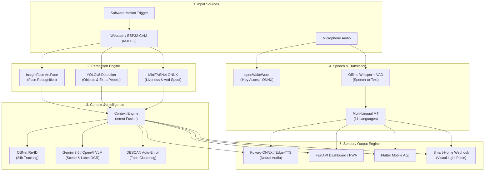

<div align="center">

# 🔔 AccessAI

### *An AI-Powered Accessibility Doorbell for Blind & Deaf Users*

[](https://www.python.org/)
[](https://fastapi.tiangolo.com/)
[](https://ultralytics.com)
[](https://github.com/thewh1teagle/kokoro-onnx)
[](#system-architecture--phase-roadmap)
[](#multilingual--accessibility-modes)
[](#testing--verification)
[](LICENSE)

<br/>

> *"Rahul is at the front door. He is carrying a parcel. Likely a delivery. They said: 'Package for you.'"*
>
> — **Spoken via neural speech (Blind Mode)** or **displayed in large high-contrast text + visual pulse + quick-reply chat (Deaf Mode)** in **11 languages**, controllable completely **hands-free** (*"Hey Access... who is at the door?"*).

<br/>

[Quick Start](#-quick-start) • [Key Features](#-key-features) • [Architecture](#-system-architecture) • [Phase Matrix](#-development-roadmap-phases-117) • [Voice Commands](#-hands-free-voice-commands-phase-10--11) • [API Specs](#-http--websocket-api-reference)

---

</div>

## 🌟 Visual Showcase

<div align="center">

> 💡 *To display project screenshots and live GIFs in this showcase, place your media assets in `docs/assets/` as outlined in the [Media Assets Setup](#-media-assets--placeholders) section below.*

| **Live Accessibility Dashboard** | **Native Mobile App (Flutter)** |
|:---:|:---:|
|  |  |
| *Real-time vision feed, status indicators & multi-modal output* | *Cross-platform control, LAN push notifications & history log* |

</div>

---

## 🎯 Executive Overview

Standard doorbells provide a binary alert: *"someone is at the door."* For visually or hearing-impaired individuals, this lack of contextual awareness creates anxiety, safety risks, and physical barriers. 

**AccessAI** transforms a standard camera stream into an intelligent multi-modal perception bridge. Built across **17 complete, production-grade development phases**, AccessAI processes computer vision, neural biometrics, anti-spoof liveness, scene understanding, speech recognition, multi-lingual translation, and text-to-speech in under **2.5 seconds**—delivering personalized sensory output tailored directly to the user's specific accessibility needs.

### 🔑 Dual Accessibility Modes
* 👁️ **Blind Mode:** Operates 100% hands-free. Listens continuously for the custom wake phrase **"Hey Access"**, speaks detailed visitor announcements using human-like offline neural voices (Kokoro-ONNX), and accepts spoken natural language queries.
* 👂 **Deaf Mode:** Replaces audio alerts with high-contrast visual status cards, flashing smart-home light webhooks, auto-captions, and instant quick-reply buttons (e.g., *"Please leave the package at the door"*).
* 🌓 **Dual/Both Mode:** Combines full visual alerts and spoken neural audio concurrently.

---

## ⚡ Key Features

* 👤 **Biometric Face Recognition:** Zero-latency face identification using InsightFace ArcFace (`buffalo_l`) paired with rolling vector databases for trusted vs. unknown visitor classification.
* 📦 **Contextual Object & Delivery Fusion:** Real-time YOLOv8 object detection recognizes packages, backpacks, and accessories, fusing bounding boxes with intent algorithms to detect courier deliveries.
* 🛡️ **Anti-Spoofing Liveness Verification:** Multi-spectral ONNX MiniFASNet models analyze facial depth and micro-textures to detect photorealistic photo/screen spoof attempts, instantly downgrading fake faces to `Unknown`.
* 👁️‍🗨️ **Cloud Vision & Parcel OCR:** Triggers Gemini 3.6 Flash / OpenAI-compatible Vision-Language Models (VLM) for unknown visitors to parse clothing appearance, environmental context, and shipping label text.
* 🗣️ **Natural Offline Neural Voice (TTS):** Human-quality voice synthesis via Kokoro-ONNX and Edge-TTS with graceful multi-tier fallbacks down to system `espeak`.
* 🎙️ **Hands-Free Voice Command Engine:** Offline wake-word detection powered by ONNX `openWakeWord` driving natural language voice control.
* 🔁 **Visitor Re-ID & DBSCAN Auto-Enrollment:** Tracks repeat unknown visitors across 24 hours using OSNet feature embeddings, offering one-tap auto-enrollment for frequent guests.
* 📱 **Native Flutter & PWA Ecosystem:** Complete web-based responsive PWA dashboard and cross-platform native Flutter mobile application with LAN WebSockets and motion alerts.
* 🔒 **Hardened LAN Security & ESP32 Integration:** Token-based bearer auth, IP rate-limiting, and HMAC SHA-256 webhook signatures for lightweight ESP32-CAM doorbell microcontrollers.

---

## 🏗️ System Architecture

AccessAI relies on a single immutable event entity—the **`VisitorEvent`**—which acts as the pipeline's backbone. Every module inspects, populates, or transforms fields on this event object as it progresses through perception, decision, translation, and notification stages.



---

## 🚀 Quick Start

### 📋 Prerequisites
* **OS:** Linux (Ubuntu/Debian recommended) or macOS
* **Python:** 3.12
* **System Libraries:**
  ```bash
  sudo apt update && sudo apt install -y espeak libportaudio2 ffmpeg build-essential python3-dev
  ```

### 💻 Installation & Setup

1. **Clone the Repository:**
   ```bash
   git clone https://github.com/vineeey/AccessAI.git
   cd AccessAI
   ```

2. **Create & Activate Virtual Environment:**
   ```bash
   python3 -m venv .venv
   source .venv/bin/activate
   ```

3. **Install Dependencies (Recommended Installer):**
   > ⚠️ **Important:** Do *not* run plain `pip install -r requirements.txt`. To preserve strict PyTorch 2.4.1 CPU pins and install non-dep packages (e.g., `kokoro-onnx`), use the automated installer script:
   ```bash
   ./scripts/install_deps.sh
   ```

4. **Environment Setup (Optional Cloud Vision Keys):**
   ```bash
   cp .env.example .env
   # Add your OpenAI / Gemini API key for VLM scene descriptions:
   # OPENAI_API_KEY=your_api_key_here
   ```

5. **Launch AccessAI:**
   ```bash
   python3 run.py
   ```

6. **Access Dashboard:**
   Open **`http://localhost:8000`** in your browser.

---

## 📊 Development Roadmap (Phases 1–17)

Every single phase listed below is **100% implemented, tested, and fully functional** in this codebase.

| Phase | Core Capability | Key Technical Modules | Implementation Status |
|:---:|:---|:---|:---:|
| **01** | Core Foundation & Pipeline Spine | `pipeline`, `camera`, `database`, `server` | ✅ Complete |
| **02** | Deep Face Recognition | `face_module` (InsightFace ArcFace) | ✅ Complete |
| **03** | Object & Scene Detection | `vision_module` (YOLOv8), `context_engine` | ✅ Complete |
| **04** | Accessibility Output Routing | `accessibility`, `tts_module` | ✅ Complete |
| **05** | Anti-Spoofing & Liveness | `antispoof_module` (MiniFASNet ONNX) | ✅ Complete |
| **06** | Cloud VLM & Label OCR | `vlm_module` (OpenAI / Gemini VLM) | ✅ Complete |
| **07** | Offline Speech Recognition | `speech_module` (Whisper + Silero VAD) | ✅ Complete |
| **08** | Multi-Language Translation | `translate_module` (11 Languages) | ✅ Complete |
| **09** | Re-ID & Auto-Enrollment | `reid_module` (OSNet), `auto_enroll` (DBSCAN) | ✅ Complete |
| **10** | Hands-Free Voice Commands | `wakeword_module`, `voice_commands` | ✅ Complete |
| **11** | Natural Offline Neural Audio | `tts_module` (Kokoro-ONNX / Edge-TTS) | ✅ Complete |
| **12** | Async Background Enrichment | `pipeline`, `vlm_module` (Async Speed-up) | ✅ Complete |
| **13** | Web Photo Enrollment UI | `server`, `face_module` | ✅ Complete |
| **14** | Responsive PWA Dashboard | `web/` (Progressive Web App) | ✅ Complete |
| **15** | Multi-Person Group Scenes | `visitor_event`, `accessibility` | ✅ Complete |
| **16** | Native Flutter Mobile App | `mobile/` (Cross-platform client) | ✅ Complete |
| **17** | LAN Hardening & Security | Bearer Auth, HMAC Webhooks, Motion Engine | ✅ Complete |

---

## 🎙️ Hands-Free Voice Commands (Phase 10 & 11)

For blind users, AccessAI provides a voice control interface requiring zero physical touching. 

### Wake Word Activation
Saying **"Hey Access"** (or clicking **🎤 Speak a Command** on the dashboard) opens a 4-second audio window. Commands are processed by a pure, unit-tested intent parser (`accessai/voice_commands.py`):

| Spoken Command | Detected Intent | System Action & Response |
|:---|:---|:---|
| *"Who is at the door?"* | `who_is_there` | Captures camera frame, runs full perception pipeline, speaks announcement. |
| *"Analyze the door"* / *"What do you see?"* | `analyze_now` | Re-evaluates visual scene & speaks detailed contextual description. |
| *"Recent visitors"* / *"Who came earlier?"* | `recent` | Queries SQLite database and speaks the latest visitor log summary. |
| *"How many visitors today?"* | `count_today` | Counts today's doorbell events and announces total tally. |
| *"Open the camera"* | `open_camera` | Focuses live stream view on connected dashboard interfaces. |
| *"Set blind / deaf mode"* | `set_mode` | Dynamically toggles active accessibility mode. |
| *(Any unknown audio)* | `unknown` | Provides a friendly spoken help dialog listing available commands. |

---

## ⚙️ Configuration & Hardware Setup

All system options are centralized in **[`config.py`](config.py)**.

```python
# System Switches & Security
ACCESSIBILITY_MODE = "both"         # "blind" | "deaf" | "both"
USER_LANGUAGE = "ml"                # ISO language code (e.g. en, hi, ml, ta, te)
ENABLE_WAKEWORD = True              # Hands-free voice commands
WAKEWORD_ALWAYS_ON = True           # Continuous background microphone listening

# Feature Flags
ENABLE_FACE = True                  # InsightFace ArcFace recognition
ENABLE_VISION = True                # YOLOv8 object detection
ENABLE_ANTISPOOF = True             # Liveness checks
ENABLE_VLM = True                   # Vision-language model descriptions
ENABLE_REID = True                  # OSNet 24-hour appearance tracking
ENABLE_AUTOENROLL = True            # DBSCAN frequent stranger clustering
```

### 📹 Hardware Integration: ESP32-CAM Setup
Switching from a laptop webcam to an external **ESP32-CAM** board requires modifying **exactly one line** in `config.py`:

```python
# Laptop Webcam:
CAMERA_SOURCE = 0

# ESP32-CAM Network Stream (One-line swap):
CAMERA_SOURCE = "http://192.168.1.50:81/stream"
```

For hardware wiring, flashing details, and HMAC authentication, refer to **[`docs/HARDWARE.md`](docs/HARDWARE.md)**.

---

## 🌐 HTTP & WebSocket API Reference

AccessAI exposes a full RESTful & WebSocket API via **FastAPI**:

| Method | Endpoint | Description |
|:---:|:---|:---|
| `GET` | `/` | Responsive Web Dashboard & PWA |
| `GET` | `/video` | Live MJPEG Video Stream |
| `POST` | `/trigger` | Manual doorbell trigger (runs full perception pipeline) |
| `POST` | `/ring` | Doorbell hardware webhook (supports optional HMAC signature) |
| `GET` | `/status` | Central system health monitor (all module statuses & flags) |
| `POST` | `/listen` | Push-to-talk voice command submission |
| `GET` | `/history` | Visitor log event history |
| `POST` | `/enroll` | Register a new face with custom name and metadata |
| `POST` | `/mode` | Switch accessibility mode (`blind`, `deaf`, `both`) |
| `WS` | `/events` | Real-time WebSocket event & audio stream broadcast |

---

## 🌐 Multilingual & Accessibility Modes

AccessAI supports **11 major languages** (English + 10 Indian regional languages) for speech recognition, translation, and voice synthesis:

$$\text{Languages} = \{\text{English (en)}, \text{Hindi (hi)}, \text{Malayalam (ml)}, \text{Tamil (ta)}, \text{Telugu (te)}, \text{Kannada (kn)}, \text{Bengali (bn)}, \text{Marathi (mr)}, \text{Gujarati (gu)}, \text{Punjabi (pa)}, \text{Urdu (ur)}\}$$

Speech output uses specialized regional neural voices (e.g., `ml-IN-SobhanaNeural`, `hi-IN-SwaraNeural`), ensuring natural native pronunciation.

---

## 🧪 Testing & Verification

The repository includes a comprehensive `pytest` suite testing all core logic isolated from hardware dependencies.

```bash
# Run tests synchronously
pytest -q
```

### Test Coverage Highlights
* `tests/test_context_engine.py`: Intent decision matrix & confidence score bounds.
* `tests/test_accessibility.py`: Announcement text composition for all visitor scenarios.
* `tests/test_voice_commands.py`: Pure intent parsing & query routing.
* `tests/test_reid.py`: Cosine similarity feature matching across temporary SQLite galleries.
* `tests/test_auto_enroll.py`: DBSCAN face vector clustering & prompt generation.

---

## 🔍 System Verification & Real Components

AccessAI operates with complete technical transparency. Every module is verified at boot time and reported via `/status`:

| Subsystem Module | Production ONNX / Real Model | Fallback Component (If Model Absent) | Current Status |
|:---|:---|:---|:---:|
| **Face Biometrics** | InsightFace ArcFace (`buffalo_l`) | *None (Required)* | ✅ **Real Model Active** |
| **Object Detection** | Ultralytics YOLOv8 (`yolov8n.pt`) | *None (Required)* | ✅ **Real Model Active** |
| **Anti-Spoof Liveness** | Silent-Face MiniFASNet (`models/antispoof/`) | Laplacian Texture Heuristic | ✅ **Upgraded (ONNX Present)** |
| **Visitor Re-ID** | OSNet Feature Extractor (`models/reid/`) | HSV Color Histogram | ✅ **Upgraded (ONNX Present)** |
| **Wake-Word Engine** | Custom *"Hey Access"* (`models/wakeword/`) | Pretrained *"Hey Jarvis"* Phrase | ✅ **Upgraded (ONNX Present)** |
| **Neural TTS** | Kokoro-ONNX (`models/kokoro/`) | Edge-TTS / System `espeak` | ✅ **Real Model Active** |
| **Speech-To-Text** | OpenAI Whisper (Offline CPU) | Energy/RMS Audio Gate | ✅ **Real Model Active** |
| **Cloud Vision** | Gemini 3.6 Flash / OpenAI API VLM | YOLO-only Perception | ✅ **Active (with API key)** |

---

## 📁 Media Assets & Placeholders

To populate the visual showcase with real screenshots from your installation:

1. Create a `docs/assets/` directory if it does not exist:
   ```bash
   mkdir -p docs/assets
   ```
2. Save your web dashboard screenshot as `docs/assets/dashboard_preview.png`.
3. Save your mobile app preview as `docs/assets/mobile_preview.png`.

---

## 📄 License & Acknowledgments

This project is licensed under the **MIT License** - see the [LICENSE](LICENSE) file for details.

* Built with ❤️ for universal accessibility.
* Powered by [FastAPI](https://fastapi.tiangolo.com/), [Ultralytics YOLOv8](https://ultralytics.com), [InsightFace](https://github.com/deepinsight/insightface), [Whisper](https://github.com/openai/whisper), and [Kokoro-ONNX](https://github.com/thewh1teagle/kokoro-onnx).

<div align="center">

---
**AccessAI** · Empowering Independence Through Intelligent Accessibility
</div>
